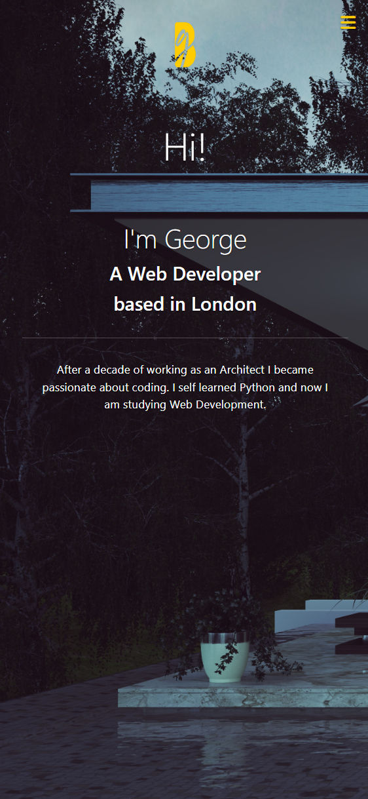

# Portfolio Application In Bootstrap 

## Description

This website is as personal portfolio showcasing some of my work experience and skills in computer programming.

&nbsp;
## Features
Web application has been created using HTML, CSS, JAVASCRIPT and Bootstrap including responsive design. 

&nbsp;
## Moch-up
The following image shows the web application's appearance and functionality:

&nbsp;
#### ** Computer Preview **

#### ** Mobile Preview **

&nbsp;
## Website URL

https://georgeboholteanu.github.io/bootstrap-portfolio/

&nbsp;
## Github Repo

https://github.com/georgeboholteanu/bootstrap-portfolio

&nbsp;
&nbsp;
### Contact
For any suggestions or ideas ping me at [@George Boholteanu](george.boholteanu@gmail.com)

---© 2022 George Boholteanu. All Rights Reserved.